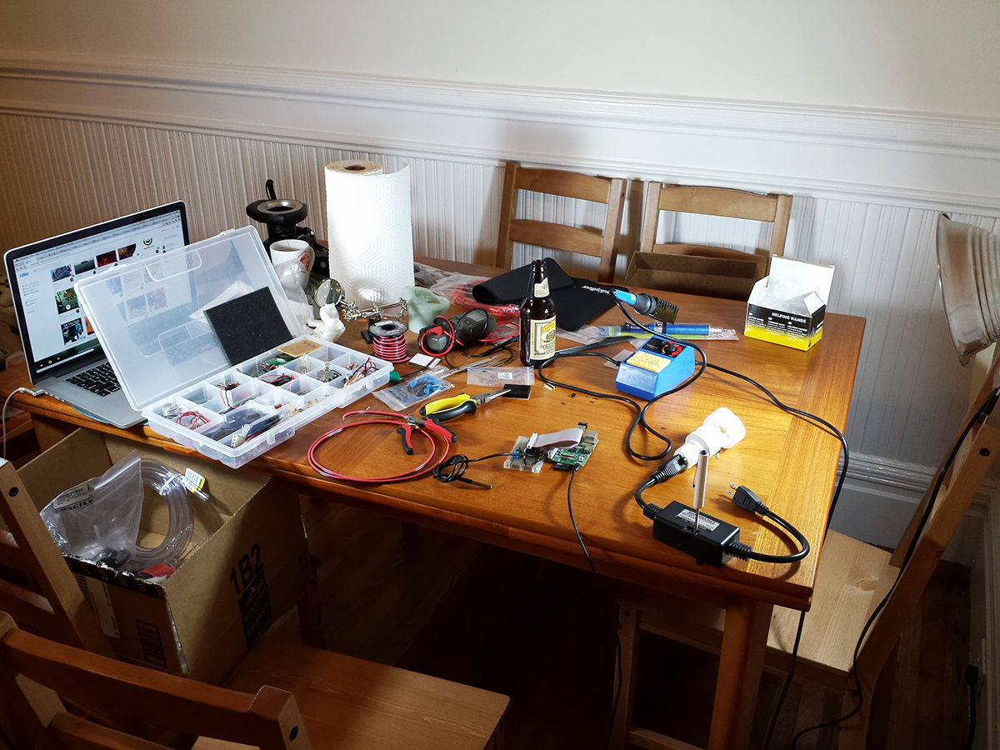

Title: Sous Vide from Scratch
Author: Will Haldean Brown
CSS: style.css

Sous Vide from Scratch
======

Modernist cuisine for hackers
------

When one cooks meat, the goal is to get the internal temperature of the meat to
whatever value indicates that the meat is tender and delcious. For most meats,
this is in the 50 &deg;C &ndash; 65 &deg;C range. However, to cook them
expediently we use cooking surfaces that are significantly hotter than that
&mdash; a frying pan on high can get up to 240 &deg;C, four times the target
temperature! The result is that the outside of your steak is cooked to 200
&deg;C so the inside can be 55 &deg;C.

[Sous vide][sousvide] is a method of food preparation that operates on a simple
principle; instead of using a cooking surface that is very hot so the food cooks
quickly, use a cooking surface that is exactly the temperature you want your
food to be (or, if you're impatient, slightly above).  Then, all you need to do
is let your food reach thermal equilibrium with the cooking surface and it's
ready to eat.

A sous vide cooker uses a water bath as the heating surface, and the temperature
of the water is very precisely maintained at the desired temperature of the
meat. The food is then sealed in a plastic bag to prevent moisture from escaping
and placed in the bath. Cooking times range from 20 minutes to 72 hours, but
when your meat comes out, it's done perfectly all the way through instead of
great in the middle and dry on the outside.

The sous vide cooker I made was built entirely from scratch; I wrote my own UI,
my own controller and built the hardware and the tank. I wrote this page with
the intention of making it easier for people to do what I did and build a cooker
from scratch. Many of the resources online for building sous vide cookers
describe how to build one assuming you have a PID controller, or using a
hacked-together UI. I wanted to build a professional-quality controller in an
integrated system, and I couldn't find anyone else that had done so and posted
documentation. If anything here is unclear or missing detail, please don't
hesitate to email [sousvide@haldean.org][mail] with any questions or suggestions
for additions to this page.

I started designing and building my sous vide in July 2013. As of August, I've
got version one (SV1) of the hardware completed and I am upgrading it piecemeal
to version two (SV2). All of the hardware and software sources for the SV1 and
SV2 builds can be [found on Github][github].

[sousvide]: http://en.wikipedia.org/wiki/Sous-vide
[mail]: mailto:sousvide@haldean.org

### Hardware and Electronics

The hardware running all of the control systems is dead-simple. A [Raspberry
Pi][rpi] runs all of the control software as well as the web server that
provides the UI.  The Raspberry Pi's internal GPIO is used to communicate with
the two peripherial electronic devices: a [PowerSwitch Tail][powertail] for
controlling the heaters and a [digital temperature sensor][ds18b20] for
measuring the water bath temperature. The PowerSwitch switches three [immersion
heaters][heaters] connected in parallel.  Also present is a [submersible
pump][pump] that recirculates the water to maintain a more homogenous
temperature field, which gets its power from the same circuit that powers the Pi
(and is thus always on when the cooker is plugged in and switched on). There is
a master switch that controls the whole cooker that turns the Pi on and off.

The Rasperry Pi gets it's link to the internet through a tiny [WiFi
adapter][wifi]. It's running [Occidentalis][occidentalis], a fork of the
Raspbian operating system that bundles a number of kernel modules that are
useful for hardware hacking; in particular, in includes modules for the WiFi
adapter and the `w1-gpio` and `w1_therm` modules, used for the 1-wire
temperature sensor.

For the SV1 build, I connected the Rasperry Pi to the peripherials using a [Pi
Cobbler][picobbler] from Adafruit and a breadboard. For the SV2 build, I
designed a PCB to serve as a breakout from the Raspberry Pi's GPIO header to the
necessary peripherials; the designs for the PCB can be seen in the [`pcb`
directory of the project][github] and can be ordered from [OSH Park][oshpark].

The SV2 board also adds some status LEDs; there is an LED for displaying system
power, an LED for displaying whether the heater is on and a status LED whose
purpose has not yet been decided. The heater is connected to the PCB by screw
terminals, the thermistor by a female header, and the Raspberry Pi by a 26-pin
ribbon cable, all of which were bought from Sparkfun.  All other parts are
surface-mount and were bought from Mouser.

The total BoM cost for the electronics and hardware came out to $128.

[rpi]: http://www.raspberrypi.org/
[powertail]: http://www.powerswitchtail.com/Pages/default.aspx
[ds18b20]: http://www.adafruit.com/products/642
[heaters]: http://www.amazon.com/gp/product/B000I8VE68/
[pump]: http://www.amazon.com/gp/product/B006M6MSL0/
[occidentalis]: http://learn.adafruit.com/adafruit-raspberry-pi-educational-linux-distro/occidentalis-v0-dot-2
[wifi]: http://www.amazon.com/gp/product/B006ZZUK5Y/
[picobbler]: http://learn.adafruit.com/adafruit-pi-cobbler-kit/overview
[oshpark]: http://oshpark.com/shared_projects/7Hz0psmY
[github]: https://github.com/haldean/sousvide

### User Interface

The UI of this sous vide cooker is all provided through a web interface that is
simple, easy-to-use and mobile-friendly.

The UI is provided by a Go backend that runs directly on the Raspberry Pi. The
backend provides both the control loop and the UI; this has the advantage that
the UI can surface a lot of debugging information directly from the control loop
if needed.

The web UI allows you to view a graph of the actual and target temperatures,
with an overlay that shows at what times the heater was on. The graphs are
generated SVG and are refreshed through Javascript once a second. The UI also
shows the current and target temperatures in numeric form, the current error,
the average error over the last 90 seconds, the most the temperature has
overshot in the last 90 seconds, and whather the heaters are on or off. All data
in the UI is live-updated by making a call to the backend's JSON API once a
second. The backend provides this data by taking successive snapshots of the
machine's state every 3 seconds. These snapshots are then stored in a ring
buffer whose size is large enough to store about 200 minutes worth of data (4096
snapshots). The ring buffer's size is limited to prevent memory pressure on the
Raspberry Pi; it only has 256 MB of RAM on board, and about a quarter of that is
dedicated to graphics memory and another quarter is used by the OS.

### Control system

The controller uses a variation on a [PID controller][pid] to determine whether
the heaters should be on or off. Since the output of the control loop must, by
nature of the hardware, be binary (the heaters cannot be half-on; they are
either on or off), two aspects of the traditional PID controller do not apply:

- The output of a PID controller is continuous and unbounded, but I need a
  single binary output, so the continuous output has to be mapped to a binary
  on/off somehow.
- The integral term of a PID controller has no purpose. From a handwavey
  perspective, the purpose of the integral term is to make the machine "try
  harder" when the system is not responding adequately to the control. In the
  case where the controller gives a binary output, "try harder" has no meaning.
- The integral term will often cause an overshoot in a slow-moving system like
  this one, and it's more important that the food never exceed the cooking
  temperature than that it heats up quickly for cooking sous-vide.

The combination of these three led me to do two things: first, I completely
eliminated the integral term, effectively making a PD controller. Often, in
industrial systems, the derivative term is ignored and a PI controller is used,
because the input signal is noisy and thus the local derivative is not
particularly useful. However, the sous-vide cooker is a very slow-moving system
and the thermocouple I used is extremely stable &mdash; there is almost no noise
in it at all &mdash; so the derivative actually ends up being a very useful
term. Since the system is very slow to respond to the heaters, you need to be
very proactive in turning them off when you get close to the target value.

The second unusual thing I did was that I binarized the output of the
controller; an output from the controller of greater than zero corresponds to
heaters-on, and zero or less corresponds to zero-off. Doing this has the nice
property that constant scaling factors do not matter when tuning the PID
parameters; since only the sign of the output is used, it does not matter if the
parameters are scaled because the sign will not change.

After a few hours of fiddling and trial-and-error, I settled on a P-term of 1
and a D-term of 2. This reflects the importance of anticipating the approach to
the target value; since the heaters stay hot after they've been turned off, the
controller has to compensate by turning off the heaters early. Conversely, when
the system starts cooling down, even if it's above the target, the controller
needs to turn the heaters on in anticipation because they take a while to come
to temperature.

[pid]: http://en.wikipedia.org/wiki/PID_controller

### Physical design

The physical design went through a number of revisions before SV1 was
functional, and then some minor revisions before SV2 to make getting in and out
of the cooker more convenient. I initially wanted to create it as an integrated
solution in a cooler for the nice thermal properties that a cooler would have,
but this proved fruitless; the walls of the cooler were too thick to mount
anything on, and the lid was difficult to cut with the hand tools I had on hand.

I ended up building it in a stainless steel food service container with a
plastic lid. The lid had three holes drilled in it that were the approximate
diameter of the cords for the heaters. I then snipped the plugs off of the
heaters, threaded the cords through the lid so the heaters were hanging down but
flush with the lid, and filled the holes with food-grade epoxy to hold them in
place. I replugged the heater cables and attached them to a 3-outlet adapter
which plugs into the PowerSwitch. The pump has suction cups on the back and is
mounted to the side of the tank so that the output of the pump flows over the
heaters. The cable snakes out of the tank via a notch cut into the lid of the
tank. The thermistor hangs from another hole in the lid so that it is a few
inches in front of the impeller of the pump. I chose to not epoxy the thermistor
in place so that I could move it around the tank to test the homogeneity of the
water temperature.

The three components internal to the tank (pump, heaters and thermistor) are all
clustered at one end of the tank. I sawed the lid into two pieces; the shorter
piece, about 20 cm long, has the heaters mounted to it, as well as the notch for
the pump cable and the hole for the thermistor, and is epoxied to the tank to
keep it stationary. The longer piece is about 60 cm long and can be freely
removed to get food in and out. This is a feature of SV2; SV1 had a single lid
piece with the heaters on it, which meant that you needed to disable the heaters
to insert/remove the food. Often, that is when the most thermal noise is
introduced to the system, so it was important to modify it so the heaters could
compensate while I was mucking around in the water.

The main power for the system is provided to a power strip, into which the
Raspberry Pi, the PowerSwitch and the pump are plugged. In SV2 (or maybe SV3)
all of the components that are not mounted to the tank will be enclosed in a
small box (the PowerSwitch, the Raspberry Pi and the power strip) but I haven't
finalized the design for that enclosure yet.
